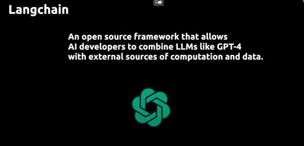
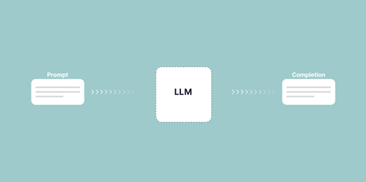
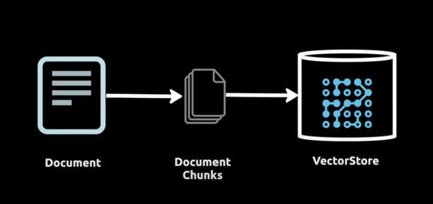
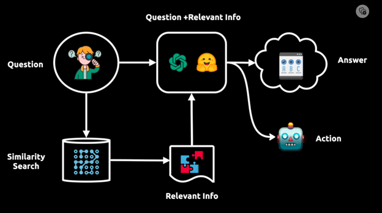
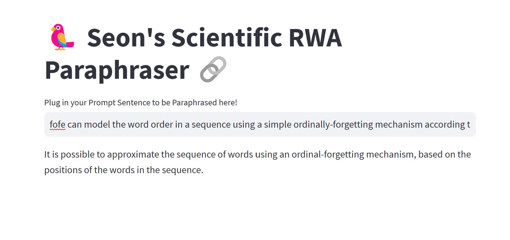
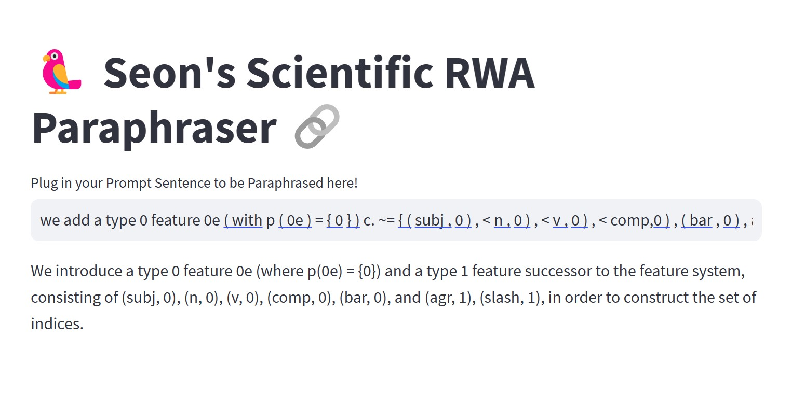

# My Scientific RWA ParaPhraser with LangChain

This repo contains a work in progress for my internship Scientific Research Writing Assitant Paraphraser. As I was working on my Special Studies "creating a Legal QA system for Dummies "with the LangChain Framework , I wanted to try out the same on my internship task at hand -a Paraphraser. Even though LangChain gets popular recently with the introduction of ChatGPT , I haven't found not so many people working on the Paraphrasing task using LangChain . You can go online and see not much has been covered/tutorialized by experts alike .

## Introduction

A paraphrase is a restatement of meaning with different expressions. Being very common in our daily language expressions, it can also be applied to multiple downstream tasks of NLP, such as generating diverse text or adding richness to a chatbot.

For Quick Intro to LanChain ;

LangChain is a fantastic tool for developers looking to build AI systems using the variety of LLMs (large language models, like GPT-4, Alpaca, Llama etc), as it helps unify and standardize the developer experience in text embeddings, vector stores / databases (like Chroma), and chaining it for downstream applications through agents.

Since we can read more about LangChain in its Documentation [🦜️🔗 LangChain | 🦜️🔗 LangChain](https://docs.langchain.com/docs/) I won't go further into it.

Most of the LangChain Projects are highly backed by OpenAi apikey . That's the beauty of LangChain and most of the even Novice Programmer like me could make it applicable in their applications. But, since there is a rate limit on API and it can be costly if we were to use it for longer period of time for longer text generation like our Scientific RWA paraphrasing . We can combine LangChain with GPT-2 and HuggingFace, a platform hosting cutting-edge LLM and other deep learning AI models. This has the added benefit of not incurring any charges since we'll not be using OpenAI . ( To note : we may now have the ability to choose the model that we want ...)

---

# The Case of Prompt Engineering/Fine Tuning

Since LangChain can let us combine LLMs with our own sources of Computaion and Datasets . We now have the ability to fine-tune / prompt engineer the model to our own liking and taste!

( If Prompt engineering is a foreign term for you, I've got you! Here is some definition .

**Prompt Engineering**

One of the main use cases of LLMs are
generating text, as they are pre-trained with a large collection of text data.
The text data used to prompt the model consists of a collection of short
examples of the task at hand. The model studies the content, identifies a
pattern in the text data, and proceeds to generate text. This is a popular
concept called Prompt Engineering.

The ability of a model to perform on a certain task,
depending on the amount of examples or prompt data given to it, can be
categorized into various operating modes.

* Few-shot
  learning is the concept of classifying new data by feeding the pretrained
  model with a few examples of labeled data of each class to nudge prompt
  completion in the right direction.
* One-shot
  learning is the concept of feeding the model with a single example per
  class
* Zero-shot
  learning is the concept of classify unseen classes without any training
  examples given, enabling it to perform well on unseen tasks )
* 

# The Importance of Dataset

Based on the above explanation of Prompt Engineering, we are to note of the importance of the kind of Dataset that we choose!

We ( My Internship Mentor Amanda and I) propose ParaSCI, the first large-scale paraphrase dataset in the scientific field, including 33,981 paraphrase pairs from ACL (ParaSCI-ACL) and 316,063 pairs from arXiv (ParaSCI-arXiv).

The major advantages of paraphrases in ParaSCI lie in the prominent length and textual diversity, which is complementary to existing paraphrase datasets. ParaSCI obtains satisfactory results on human evaluation and downstream tasks, especially long paraphrase generation.

### Detailed Statistics for ParaSCI

| Name          | Source                  | Size (pairs) | Gold Size (pairs) | Len   | Char Len | Self-BLEU |
| ------------- | ----------------------- | ------------ | ----------------- | ----- | -------- | --------- |
| ParaSCI-ACL   | ACL Anthology & S2ORC   | 59,402       | 33,981            | 19.10 | 113.76   | 26.52     |
| ParaSCI-arXiv | ArXiv Bulk Data & S2ORC | 479,526      | 316,063           | 18.84 | 114.46   | 29.9      |

---

# Customized Dataset?

But since we only want a high-quality state-of-the-art paraphraser that we can use in our scientific research writing projects, we will create a custom dataset filtered on top of ParaSCI to preserve only diverse high-quality paraphrases.

Diverse here means that pairs of sentences are selected such that there is a significant difference in word order or at least the paraphrased output differs by multiple word changes or in this case,Longer Paraphrase Generation.

But remember fine tuning/Prompt Engineering  has three alternatives: one shot, few shot and zero shot! But for this purpose of Fine-Tuning with the nature of LangChain and all, we will go with one shot! We
can see how much will the quality improve with every step of the way !

( This Project is still in its infantile stage ! With the permission of my mentor , I will continue working on it)

Here's some screengrabs of the project's interface so far! 

Even though it still yet has to be fine tuned with our custom dataset ! with a little bit of prompt template engineering , I picked out a few of my source sentences from on-going custom dataset from ParaSCI and it works perfectly as you can see.

---

To run the app :

Requirements:

Pip install streamlit

Pip install langchain

Pip install openai

Pip install Wikipedia

Pip install chromadb

Pip install tiktoken

in your terminal go to your file location and run : streamlit run my_app.py 

or if you can't run and having trouble to run the streamlit app as i am for days ,tackling with environment issues 

you can just run the app on top of python system that your device has installed -might need to grant permission , then follow the same file path and run : python -m streamlit run my_app.py

Thank you!

---

Refrences : ( to be added )

|  |  |  |  |  |  |  |
| - | - | - | - | - | - | - |
